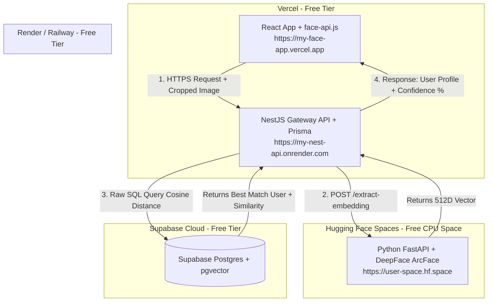

# MASTER IMPLEMENTATION PLAN - HỆ THỐNG NHẬN DIỆN KHUÔN MẶT (FACE RECOGNITION APP)

Dưới đây là **Bản Kế Hoạch Triển Khai Hoàn Chỉnh (Master Plan)** tổng hợp toàn bộ giải pháp kiến trúc, công nghệ, cấu hình cơ sở dữ liệu, mã nguồn mẫu và chiến lược deploy 100% miễn phí đã thống nhất.

---

## 📌 1. TỔNG QUAN DỰ ÁN & MỤC TIÊU

### Mục Tiêu Hệ Thống
- **Đăng ký khuôn mặt (Enrollment)**: Người dùng chụp ảnh qua Webcam hoặc Upload ảnh -> Hệ thống trích xuất và lưu trữ đặc trưng khuôn mặt (**Vector 512 chiều**).
- **Nhận diện khuôn mặt (Recognition)**: Quét khuôn mặt từ Webcam (Laptop/Điện thoại) hoặc Upload 1 ảnh bất kỳ -> Hệ thống tự động truy vấn và trả về danh tính người dùng trùng khớp cùng **Độ tin cậy % (Confidence Score)**.

### Định Hướng Kiến Trúc: Hybrid Architecture (Khuyên Dùng)
- **Client (React)**: Phát hiện khuôn mặt thực tế (Face Detection) ở tốc độ 30-60 FPS bằng `face-api.js`, vẽ khung xanh UI mượt mà, tự động cắt (crop) vùng mặt.
- **AI Microservice (Python DeepFace)**: Nhận ảnh đã crop -> Trích xuất **Vector Embedding 512D** bằng thuật toán **ArcFace** chuẩn xác (99.5%).
- **Backend (NestJS + Prisma)**: Điều phối API, xác thực, gọi AI service và kết nối DB.
- **Database (Supabase PostgreSQL + pgvector)**: Lưu trữ mảng vector 512D và thực hiện phép toán tìm kiếm khoảng cách Cosine (`<=>`) cực nhanh.

---

## 🛠️ 2. BỘ CÔNG NGHỆ (TECH STACK)

| Tầng | Công nghệ sử dụng | Vai trò & Mục đích |
| :--- | :--- | :--- |
| **Frontend** | React (Vite) + TypeScript | Giao diện người dùng web app linh hoạt. |
| **Client AI** | `@vladmandic/face-api` + `react-webcam` | Bật camera, vẽ khung nhận diện mặt 30 FPS trên Canvas. |
| **Backend Gateway** | NestJS (TypeScript) | API Gateway điều phối logic, xử lý upload, kết nối DB. |
| **ORM** | Prisma ORM (v5+) | Quản lý database schema, tích hợp `postgresqlExtensions`. |
| **Database** | Supabase PostgreSQL + `pgvector` | Cơ sở dữ liệu quan hệ tích hợp Vector Search (Cosine Similarity). |
| **Storage** | Supabase Storage | Lưu trữ ảnh đại diện (avatar) gốc của người dùng. |
| **AI Model Microservice**| Python FastAPI + `DeepFace` (ArcFace) | Trích xuất Vector Embedding 512 chiều từ ảnh mặt đã crop. |

---

## ☁️ 3. SƠ ĐỒ HẠ TẦNG & PHƯƠNG ÁN DEPLOY (100% MIỄN PHÍ)



### Bảng Phân Phối Deploy & Biến Môi Trường (.env)

| Thành phần | Nơi Deploy | Biến Môi Trường (.env) Cần Thiết |
| :--- | :--- | :--- |
| **React Frontend** | **Vercel** (Cung cấp HTTPS miễn phí) | `VITE_API_BASE_URL=https://my-nest-api.onrender.com` |
| **NestJS Server** | **Render.com** hoặc **Railway** | `DATABASE_URL` (Supabase Pooler 6543)<br>`DIRECT_URL` (Supabase Direct 5432)<br>`AI_SERVICE_URL=https://user-space.hf.space` |
| **AI Microservice**| **Hugging Face Spaces** (Docker/FastAPI) | Không cần |
| **Database** | **Supabase Cloud** | Extension: `vector` |

---

## 📋 4. CHI TIẾT CÁC BƯỚC TRIỂN KHAI (STEP-BY-STEP)

### BƯỚC 1: KÍCH HOẠT SUPABASE DATABASE & SCHEMA PRISMA

#### 1.1 Kích hoạt `pgvector` trên Supabase
Vào Supabase Dashboard -> **SQL Editor** và chạy:
```sql
CREATE EXTENSION IF NOT EXISTS vector;
```

#### 1.2 Cấu hình `prisma/schema.prisma`
```prisma
datasource db {
  provider   = "postgresql"
  url        = env("DATABASE_URL")   // Transaction Pooler (Cổng 6543)
  directUrl  = env("DIRECT_URL")     // Direct Connection (Cổng 5432)
  extensions = [pgvector(map: "vector")]
}

generator client {
  provider        = "prisma-client-js"
  previewFeatures = ["postgresqlExtensions"]
}

model User {
  id        String   @id @default(dbgenerated("gen_random_uuid()")) @db.Uuid
  name      String
  avatarUrl String?  @map("avatar_url")
  
  // Vector 512 chiều từ ArcFace DeepFace
  embedding Unsupported("vector(512)")?

  createdAt DateTime @default(now()) @map("created_at")

  @@map("users")
}
```

#### 1.3 Tạo Index HNSW để tăng tốc truy vấn vector
Chạy trong SQL Editor của Supabase:
```sql
CREATE INDEX idx_users_embedding_hnsw 
ON users USING hnsw (embedding vector_cosine_ops);
```

---

### BƯỚC 2: TẠO PYTHON AI MICROSERVICE (`app.py`)

Tạo 1 service Python nhỏ để dùng dưới máy local (`http://localhost:8000`) và deploy lên Hugging Face Spaces:

```python
# app.py (FastAPI + DeepFace)
from fastapi import FastAPI, UploadFile, File
from deepface import DeepFace
import numpy as np
import cv2

app = FastAPI(title="Face Recognition AI Microservice")

@app.get("/")
def home():
    return {"status": "AI Service Running"}

@app.post("/extract-embedding")
async def extract_embedding(file: UploadFile = File(...)):
    contents = await file.read()
    nparr = np.frombuffer(contents, np.uint8)
    img = cv2.imdecode(nparr, cv2.IMREAD_COLOR)
    
    # Dùng ArcFace model trích xuất vector 512D
    embedding_objs = DeepFace.represent(
        img_path=img, 
        model_name="ArcFace", 
        enforce_detection=False
    )
    
    embedding = embedding_objs[0]["embedding"]
    return {"embedding": embedding}
```

File `requirements.txt`:
```text
fastapi
uvicorn
deepface
tf-keras
opencv-python-headless
python-multipart
```

---

### BƯỚC 3: XÂY DỰNG NESTJS BACKEND GATEWAY

#### 3.1 `src/face/face.service.ts`
```typescript
import { Injectable } from '@nestjs/common';
import { PrismaService } from '../prisma/prisma.service';
import axios from 'axios';
import * as FormData from 'form-data';

interface RecognizedUser {
  id: string;
  name: string;
  avatarUrl: string;
  similarity: number;
}

@Injectable()
export class FaceService {
  constructor(private prisma: PrismaService) {}

  private aiServiceUrl = process.env.AI_SERVICE_URL || 'http://localhost:8000';

  // 1. Trích xuất vector từ AI Microservice
  async extractVector(imageBuffer: Buffer): Promise<number[]> {
    const formData = new FormData();
    formData.append('file', imageBuffer, { filename: 'face.jpg' });

    const response = await axios.post(`${this.aiServiceUrl}/extract-embedding`, formData, {
      headers: formData.getHeaders(),
    });

    return response.data.embedding;
  }

  // 2. Đăng ký người dùng mới kèm Vector
  async registerUser(name: string, avatarUrl: string, imageBuffer: Buffer) {
    const vector = await this.extractVector(imageBuffer);
    const vectorString = JSON.stringify(vector);

    await this.prisma.$executeRaw`
      INSERT INTO users (id, name, avatar_url, embedding)
      VALUES (gen_random_uuid(), ${name}, ${avatarUrl}, ${vectorString}::vector);
    `;

    return { success: true, message: 'Đăng ký khuôn mặt thành công' };
  }

  // 3. Nhận diện / Tìm kiếm khuôn mặt (Cosine Similarity)
  async identifyFace(imageBuffer: Buffer, threshold = 0.68) {
    const targetVector = await this.extractVector(imageBuffer);
    const vectorString = JSON.stringify(targetVector);

    const matches = await this.prisma.$queryRaw<RecognizedUser[]>`
      SELECT 
        id, 
        name, 
        avatar_url as "avatarUrl", 
        1 - (embedding <=> ${vectorString}::vector) as similarity
      FROM users
      WHERE 1 - (embedding <=> ${vectorString}::vector) >= ${threshold}
      ORDER BY embedding <=> ${vectorString}::vector ASC
      LIMIT 1;
    `;

    if (!matches || matches.length === 0) {
      return { match: false, message: 'Khuôn mặt không có trong hệ thống' };
    }

    const bestMatch = matches[0];
    return {
      match: true,
      user: {
        id: bestMatch.id,
        name: bestMatch.name,
        avatarUrl: bestMatch.avatarUrl,
      },
      confidence: Math.round(bestMatch.similarity * 100),
    };
  }
}
```

---

### BƯỚC 4: XÂY DỰNG REACT FRONTEND

1. Tích hợp `react-webcam` + `@vladmandic/face-api` để bật Camera và tự động vẽ khung chữ nhật (Bounding Box) xanh lá quanh khuôn mặt khi người dùng đứng trước ống kính.
2. Cắt vùng ảnh khuôn mặt (`toBlob()`) và gọi API `POST /face/identify` của NestJS.
3. Hiển thị thông báo Toast kết quả: **"Đã nhận diện: Nguyễn Văn A (Độ chính xác: 94%)"**.

---

## 🔍 5. KIỂM THỬ VÀ XÁC NHẬN (VERIFICATION PLAN)

1. **Test Local**:
   - Chạy Python Service (`uvicorn app:app --reload`).
   - Chạy NestJS Backend (`pnpm run start:dev`).
   - Chạy React Frontend (`npm run dev`).
   - Đăng ký 1 khuôn mặt mẫu -> Kiểm tra Supabase Table Editor xem cột `embedding` đã lưu đủ mảng 512 số float chưa.
2. **Test Tìm Kiếm Tương Đồng**:
   - Chụp 1 góc ảnh khác của cùng 1 người -> Đảm bảo trả về % Confidence > 80%.
   - Chụp ảnh người khác chưa đăng ký -> Hệ thống trả về `match: false`.
3. **Test Deploy Cloud**:
   - Push code Python lên Hugging Face Space.
   - Push NestJS lên Render.com.
   - Push React lên Vercel.
   - Truy cập bằng trình duyệt Safari/Chrome trên điện thoại di động -> Kiểm tra quyền cấp Camera và tốc độ phản hồi.
